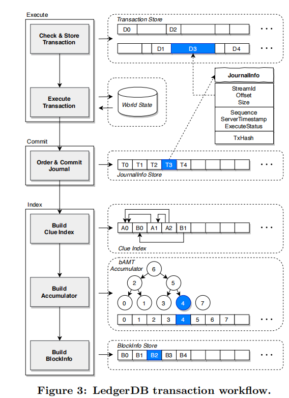

<!--
 * @Author: Leo
 * @Date: 2022-07-12 12:38:18
 * @LastEditors: Leo
 * @LastEditTime: 2022-08-06 02:18:10
-->
# LedgerDB: a centralized ledger database for universal audit and verification.
# LedgerDB: 一个可用于通用审计与验证中心化账本数据库

## 摘要

区块链的诞生引起了广泛的关注。但是，经过实践中观察发现，在私有链(Permissioned Blockchain)上许多应用上很难从这种去中心化的架构（decentralized architecture）上获益。并且在使用去中心化的架构后，系统性能往往被限制，导致吞吐量降低、高延迟和显著的存储开销。因此本文提出中心化账本数据库 LedgerDb, 它是一个中心化账本数据库，具有与区块链类似的防篡改与不可抵赖性（tamper-evidence and non-repudiation ），并且提供了强大的审计功能。与区块链相比，LedgerDB 具有高吞吐量（higher throughput) ,它采用 TSA 双向挂钩协议 （two-way peg protocol) 提供强大的审计功能 用于防止 用户与服务提供商的恶意篡改。LedgerDB 支持现实世界中被核实数据的删除操作，以实现通过删除过时的记录以节约存储空间，并为监管目的隐藏存储记录，同时不影响可验证性。实验辨明 LedgerDB 与当今最先进（state-of-the-art）的私有链(Permissioned Blockchain)相比，其吞吐量高是其80倍(i.e., Hyperledger Fabric)。由于它的高吞吐量高、延迟低、可审计性强、易于使用，许多区块链的消费者阿里云上的用户已经转向LedgerDB。

### INTRODUCTION

自从比特币推出以来，区块链以一种新的数据协作方式引入到各种应用。它使得应用程序可以由互不信任的参与者进行操作。一个区块链系统实现了哈希纠缠（hash-entangled）（默克尔树？）数据块以提供一个防篡改的账本和某种共识协议实现。去中心化是区块链系统的基础包含私有链和公有链系统两种。

一个公有链提供它的隐蔽性（cryptocurrency） 用于激励参与者，这得益于去中心化系统。然而在私有链，虽然还没有证明去中心化的必要性，但已经用于知识产权保护和商品的提供）。有趣的是，许多应用程序将其所有区块链节点部署在BaaS（Blockchain-as-a-Service，区块链即服务）的环境中，由单一的服务提供商维护。这反而导致了一个集中的基础设施。由于的真正去中心化的部署仍然没有广泛存在。许可证的区块链用例中，许多倡导者正在转向重新审视其去中心化的必要性。Gartner预测，至少有20%的项目被设想为的项目将转而在中心化的可审计账簿上运行。到2021年，至少有20%的项目将运行在中心化的可审计账本上。

为改革私有链中的中心化，我们提出了 LedgerDB - 该数据库以集中的方式提供防篡改证据和不可抵赖的功能，实现了强大的可审计性和高性能。我们称它为中心化账本数据库（centralized ledger database， cld)系统。与区块链中的集中式账本技术（centralized ledger technology ，CLT）相似，与区块链中的去中心化账本技术（decentralized ledger technology，DLT）相反。LedgerDB 由阿里巴巴集团下的蚂蚁金服开发与广泛使用。它的产生灵感来自于传统区块链数据库的局限性和账本数据库。

第一，在研究中发现许多私有链的许多用法之寻求密码学上的保护，例如哈希链和默克尔树以寻找防篡改。通常情况下，区块链中的其它思想如智能合约与去中心化均没有得到很好的利用。在这种情况下，由可信的中央机构提供了简单的可审计的账本服务，并提供基本的数据操作支持就足够了。由于其高吞吐量、低延迟和易于使用，相对区块链更有吸引力。

第二，私有链的威胁模型是不足以应对现实世界的审计。对于外部人员（第三方）稽查机构来说，由共识协议保证的数据复制具有欺骗性。例如：如果存在所有对等方的信任背书（endorsement） ，它就可以编造错误的证据以欺骗审计师的审计。更加糟糕的情况是，如果其它对等方不能提供原始链的证明给外部人员，多数人的认可就已经足够进行欺骗了。结果表明，私有链的审计是不可能的。

第三， 尽管协议中心化的可审计的账本数据库作为私有链的替代品出现，但是它们更多的依赖于可信任服务提供商。例如： AWS披露的 QLDB 是一个利用不可变和可验证的账本。 Oracle 声明了 区块链表（blockchain table). 可审计的账本要求每账本服务提供者（ledger service provider) 是完全可信任的，包括历史记录可以被追溯和验证。返回的记录是否被LSP所篡改是个未知数特别是当它与某个用户勾结时。

第四，现有系统所提供的不可更改性意味着每一个承诺的数据都作为篡改证据被永久地披露在账本上，在现实世界的应用中，这确实导致了过高的存储开销和监管问题。现实世界的应用中，这确实造成了令人望而却步的存储开销和监管问题。许多区块链用户希望清理肃清过时的记录，以节省存储费用，因为在其他情况下，这将成为无法负担的。因为随着数据量的增长，它将变得难以承受。在监管问题，那些违反法律或道德的记录(例如，在没有事先申请的情况下，上传某人的住宅地址证明）的记录一旦发生就不能被删除，这在许多应用中是不可取的。

<!-- 表1 -->


为了解决这些问题，LedgerDB 为了提高系统吞吐量采用了一个集中式和一个无状态的日志存储模型，而不是大多数区块链系统中紧耦合的交易状态模型系统。它采用了多粒度验证和不可抵赖协议, 可以有效的防止来自用户和LSP的恶意行为，消除对LSP的信任假设。通过整合数字认证和时间戳认证服务（timestamp authority, TSA）服务。部署在阿里云上的 LedgerDB 具有提供司法级别审计水平校验的能力。它已经服务于许多现实世界中类似于区块链的应用程序，如 供应链， 知识产权，监管技术和企业内部审计。本文将LedgerDB 于其它系统在表1 进行对比，并且本文的主要贡献如下所示：

1. 实践上调查了现有的审计系统之间的差别（区块链和 账本数据库） 和现实世界在审计、功能和性能方面的要求。
2. 本文开发了当今已知最好的 LedgerDB， 它是第一个中心化账本数据库，提供强审计、广泛的审查范围、低存储花销同样的也带来了高吞吐量。
3. 为了确保强大的可审计性，本文采用了不可抵赖的签名和TSA peg协议，以防止恶意的be- 签名和TSA peg协议来防止用户和LSP的恶意行为（定义见第2.2节）。
4. 我们提供可核查的数据删除操作人员，以解决存储开销和监管问题。它们有助于删除过时的记录（清除）或隐藏记录内容（隐匿）而不影响可验证性。我们还提供原生基元（线索），以促进跟踪应用层面的数据出处。
5.为了维持高水平的写密集场景。本文采用了定制的组件，如  execute-commit-index 事务工作流， 累计批次默克尔树（batch accumulated Merkle-tree， bAMT ) 和一个线索索引（ clue index, cSL). 我们的实验结果表明 站本数据库的吞吐量达到了 300，000 TPS， 超过 Hyperledger 80倍和 QLDB 30倍的性能表现。

在剩下部分我们讨论了当前方案的限制和我们设计的目的在第二章。我们预览了 LedgerDB 在 第三章并且细节设计的表现（如：journal management， verification mechanism 和provenance support） 在第4.5.6章。 用例和现实世界的实践被提供在第七章。我们提供了实验评估在第8章，并且相关工作在第九章。最后总结在第十章。


## PRELIMINARIES AND DESIGN GOALS

我们致力于设计一个账本数据库，支持类似区块链（私有链）的应用，采用中心化架构。它记录了不可更改的 应用交易（来自相互不信任的参与者）记录在具有防篡改功能的账本上，并提供普遍的审计和验证能力。在本节中，我们介绍我们的设计目标，使LedgerDB成为现有区块链系统的一个更强大的替代品。从可审计性、威胁模型、功能和性能等方面，介绍了我们的设计目标，使LedgerDB成为现有区块链系统更强大的替代品。

### 2.1 Auditability

可审计性事观察用户行为和操作轨迹的能力，他是账本数据库或者区块链系统中必不可少的属性。一个成功的审计追踪应当承诺所有被审计数据的可审计性。例如，如果一个交易被审计，这个审计人员应当确认内容未被修改并且发行人是真实的（authentic）。在这里我们将这个概念推断出两个场景， 内部审计和外部审计。内部审计是确保一个账本的内部用户可以观察和验证所授权的所有外部不受信任的用户行为（我们称之为交易）。外部审计指的是确保一个外部三方实体（审计员） 可以观察和验证账本参与者（例如 用户和账本服务提供者）进行所有交易的真实性。另一方面，在审计时， 一个参与者不能否认和恶意篡改自己交易。

大多数已存在的账本和区块链系统支持内部审计（有一定的假设或限制），但是它们之中很少支持外部审计。我们将讨论几个典型的数据的审计如下所示：（总结部分在表1)

QLDB 是由亚马逊开发的中心化数据库，在这里用户提交她们的教育一通过一个共享账本，在这个系统中LSP 完全信任所有的用户，并且它采用了服务器端的验证机制来检测并对用户的篡改行为发出警告。用户并不能意识到作为 LSP 它是否修改了它们的数据。因此，QLDB 提供了内部审计但要求LSP 必须可信。

 Hyperledger Fabric 是一个流行的私有链，其在为相互不信任的用户在一个财团（consortium）中运行协作应用。当主要成员勾结时，财团可以修改时间戳和改变账本。（超过三分之二的对等方在一个基于PBFT的共识方案中）。总之要求 Hyper ledger 提供了内审计但是要求主要的对等方是诚实的。

ProvenDB。它是一个集中式账本数据库，利用基于比特币的锚来验证账本上的时间戳。由于比特币中的内部固有时延（inherent commitment latency），因此会有一个脆弱的时间窗口问题，最近的交易可能会在他们要提交的时间窗口中受到影响。此外，由于其**单向锚定协议**，它还存在有意提交延迟的问题。总之，ProvenDB提供了类似QLDB的内部审计和有限的外部审计（来自大的脆弱时间窗口）。

Factom。它是一个用于去中心化数据公证的无权限区块链，形成了传统账本中最强的可审计模式。它的无许可去中心化使它成为应用程序可以依赖的可靠时间戳的强大来源。与非信誉交易签名一样，Factom（以及比特币）支持内部和外部审计，因为无权限，因此系统性能较差。

### 2.2 Threat Model

本文正式开始讨论我们的设计，在我们的设计中，我们完全支持内部和外部审计。对于用户和 LSP ，我仅仅假定她们的身份是可信的（通过纰漏它们的共有密钥通过CA）。此外第三方时间戳授权（timestamp authority, TSA) 需要被信任。它能够将真实和可验证的时间戳（当前时间）附加到一个给定的数据上。我们假设加密学原理（例如，消息验证码和签名 代码和签名）保证防篡改和非拒付。

除了以上的信任组件之外，任何来自参与者的行为都人为是不可信的。它们也许会去尝试去篡改和抵赖已存在的交易。我们考虑两种攻击场景：a）服务端的恶意篡改和b）LSP 与用户之间勾结,共分为三种模型的威胁。对于场景A，面临的威胁可能来自于外部攻击者、内部用户或者 LSP, 它们可以去混乱这个整个数据库服务。对手可以访问账本上的任何交易，并在用户请求到达时篡改传入的交易。（threat-A）他/她可能会篡改（例如，更新、删除、插入）账本上的历史交易，从而伪造一个假账本来欺骗用户（威胁-B）。对于方案(b)，一个或多个客户可以与LSP串通起来作为对手。该对手可以篡改或删除任何历史交易以欺骗外部审计师（威胁-C）。我们保证，上述所有威胁都能被内部参与者和外部审计人员发现。

### Design Goals

强外部校验能力， 在考虑威胁模型以前我们观察已经存在的账本数据可和私有链，它们对于上文提到的危险模型和真实世界中所面了的问题是不能够解决的。例如 QLDB对于以上提到的三种情况均是脆弱的。ProvenDB 面对 A 情况是脆弱的，但能有效的防止 威胁 B 和威胁 C。由于缺乏外部审计能力，因此它们不适合现实世界的应用，与此相反的是 LedgerDB 是基于假定大多数是可信的并且通过第三方 TSA 提供强大的外部审计能力。简单来说， 一旦TSA日志被固定在账本上，对手就不可能篡改早期数据。

高写入性能，在写入下，公有链由于其去中心化的特征显著限制了其写入性能。然而，这种去中心化的场景是必不可少的。例如对于一些应用部署在所有的区块链节点在财团的 Baas 环境上，这种情况反而会导致一个中心化的基础设施出现。在这个例子中一个中心化数据库（centralized ledger database，CLD) 在这种情况下，集中式账本数据库（CLD）更有吸引力，因为它具有高吞吐量、低延迟和易于使用的特点。此外，我们观察大多数客户在性能的关注上更多的去关心写的性能。因此  LedgerDB 在优化上更多的去关心高写入的性能和同时保持可接受的读取和验证性能。

数据移除支持。数据的不变性存在于区块链系统，其意味着所有的交易都必须永久的披露用于作为篡改证据支持校验与审计。然而，这在现实世界的应用中会造成令人望而却步的存储开销和监管问题。但是我们需要知道审计的任务并不是要求我们真的需要一个强制的不变的存储作为前提。因此我们的目的是允许移除过时（obsolete)或者 违规（violating) 的记录，同样这些错做也不影响校验与审查。因此，LedgerDB打破了不变性，而是提供了两种操作：清除删除过时的记录以节省存储成本，隐匿隐藏违规的记录以解决监管问题（详见§5.4）。这些操作增强了系统的可审计性，为客户和监管者提供了便利。


表1总结了LedgerDB与现有系统之间的主要区别。

## 3 LEDGERDB OVERVIEW


LedgerDB是一个符合上述威胁模型和设计目标的CLD系统。模型和上面讨论的设计目标，即强大的外部可审计性、高写入性能和数据删除支持。在本节中，我们将介绍LedgerDB的整体架构，以及其数据模型和API。LedgerDB既可以作为一个独立的软件，也可以作为LaaS（账本即服务）部署在云上，即CLD服务。它已被部署在阿里巴巴云上，其中数字认证和TSA服务被整合，以提供司法级别的 可审计性。我们把这种部署称为LaaS+。

### 3.1 Architecture

LedgerDB 结构如图1所示，其包含三种主要的控件： ledger master 、 ledger proxy 和 ledger server。 ledger master 管理整个集群中运行的元数据， 如服务状态或者ledger 状态。 并且并协调集群级事件（例如，负载平衡、故障恢复）。ledger proxy 接收客户端请求和预处理，并且将它们拆分到相应的 ledger server。 一个ledger server 完成最终的处理请求，并且 与存储分类账数据的底层存储层互动。不同的存储引擎被支持，如 HDFS、 rocksdb， 和 MPT （Merkle Patricial Tree)。特别是，L-Stream（LedgerDB流）是一个为LedgerDB量身定做的线性结构的append-only文件系统。它消除了昂贵的压缩（例如，RocksDB），并可以通过存储偏移量快速访问。注意，在处理交易有效载荷时，ledger代理可以直接与存储层通信（§4.2）。

LedgerDB 提供了高服务可用性和数据可靠性。它借用端到端 CRC (cyclic repudiation check) 来确保数据的完整性，在交易和接收消息的时候。存储层采用共享存储抽象，账本数据被复制到多个可用的 区和区域，并遵循筏式协议。因此，分类账服务器和分类账代理是完全无状态的，这使得它们的故障切换和重新启动很容易。

### 3.2 Data Model and APIs


在LedgerDB， 一个 ledger 操纵行为（ 初始化有用户或者 LSP) 被建模为加以，其结果是一个导致日记分录（简称 "日记"）被附加到分类账中。多个日志被进一步分组为一个账本上的区块（类似于区块链中的区块），当一个用户执行一个操作时， 首先对这个交易进行初始化在客户端和对内容进行私钥签名。这个被签名的信息被包装为一个请求发送给 ledger proxy。 表2 列出了 LedgerDB 提供的主要操作。 在这些 Api 中， ledger_uri 是每个分类账实例的唯一标识符；日志序列号（jsn）是每个日志的唯一标识符。由分类账服务器使用单调的计数器分配。我们对操作符的一些类别解释如下。

Append  增加用户交易或者系统对于ledger 产生的交易。用户交易可以包含任意的数字信息以对应应用语义（例如 交易日志，审计追踪和操作追踪）。这有四个主要的操作在目录中：

1）AppendTx 增加一个用户交易，可以与一个线索集相关联，以表达应用级别的数据出处（§6）。
2）SetTrustedAnchor 设置一个 置信锚点在中心致信水平 为随后的审查请求提供遍历 （§5.3)。
3）GrantTime 记录一份由TSA签署的公证（notary）日志，以便进行通用时间背书 (§5.2)
4）GrantRole 指定角色或权限给分类帐的一个成员。角色是一种逻辑上的 角色是一种逻辑权力，它被授予预定的操作权限 的逻辑权限（例如，正常、DBA、监管者、只验证、只读，等等)


Retrieve 从分类账中获得合格的journal。我们提供三种三种类型用于获取journal：

1）一个单子检索将一个jsn作为输入，并返回相关的相应的journal（通过GetTx）。
1) 范围检索将一个jsn范围作为输入，并返回该范围内的所有journal（通过ListTx，指定ini_jsn和限制）。
3）线索 检索将一条线索作为输入，并返回所有包含该线索的期刊s (通过指定线索的ListTx)。

此外，GetTrustedAnchor检索了一个受信任的锚。而GetLastGrantTime则检索一个时间公证（由GrantTime创建的 由GrantTime创建）。

Verify 从期刊证明中验证返回的期刊的完整性和真实性。证明是由一个实体签署的不可抵赖的证据。在LedgerDB中，用户签署交易请求的有效载荷；LSP签署交易承诺的接收；TSA签署其生成的时间公证。LedgerDB支持两种类型（级别）的验证（§5），即**服务器端和客户端**，适用于不同的场景。不同的场景。验证可以通过使用 信任的锚（§5.3）。

Create  创建一个新的账本和初始化角色和组件。 一个新的账本的创建涉及到很多组件的初始化，例如唯一的账本标识，一系列的配置系统级别的配置和第三方组件的注册工作(例如，TSA创世的时间戳)。在创建过程中应指定一个初始成员的列表。其中每个成员至少拥有一个角色。角色和成员 配置作为日志附加在创世块中 即 线索索引（§6.2），bAMT累加器（§5.1），和块 信息。 线索索引链接所有的历史通过 journals 通过它们的线索。 线索索引为所有单子服务 （singleton），范围和线索的检索 （§3.2）

Purge    从帐本种移除陈旧的 journals， 清除是指从创世块开始批量删除连续的日记（以节省存储）。

Occult  从账本中隐藏 journal(s) ， 一个occult 可以移除任意的 journal （以应对监管允许）而不影响账本的完整性。对于 occult 的 journal 不能被任何人访问，仅当 监管人员 在关心它的时候去访问它。它可以用于两种方式 1） occult 通过隐藏一系列的 journal 通过给定它们的 jsn 。 2） occult 通过线索隐藏所有的 符合条件 的 journal。 在 $5.4.2 可以找到这个设计。

还有其他的运算符，例如：recall 的效果（在一个有限的时间窗口内）；remove 删除系统中的实体，比如一个账本、一个角色、一个 成员，或线索。一旦线索被删除，包含该线索的日志将不会通过线索检索返回，但仍可通过范围检索找到它们。 我们将 payload journal
 数据展示在 图2 （a）。 一个 request-hash 经过 整个journal-data 计算 （SHA256)。然后, **用户签署请求以达到不可抵赖的目的,解决了威胁-A（§2.2）。** 最后，签名的请求 被提交给服务器。

## 4. JOURNAL MANAGEMENT

在这一小节。我们介绍 journal 的structure 和 交易处理过程， 它能确保提交的交易是不可篡改和不可伪造和 持久化的。

### 4.1 Non-repudiable Journal


在客户端中， 一个 journal 被初始化打包成一个 payload ， 它包含相关操作的 field ( ledger_uri, transaction type, clus) 和 客户端相关 fields （如  client sequence， timesamp 和 nonce）

在服务器端，如图2（b）所示，一个日志结构被称为服务器-日志。除了上述的客户端有效载荷外，服务器还在日志中附加了一些字段，如jsn、流位置（§4.2）、服务器时间戳、执行收据和成员状态。然后，服务器计算一个日志哈希值，它是整个服务器端日志的摘要。jsn（即服务器序列）是一个单调递增的整数，分配给每个进入的日志。

日志提交后，服务器向客户端返回一个日志收据，如图2（c）所示。一个块哈希 指的是包含该日志的区块。除了三个 摘要（即，请求-哈希，日志-哈希，区块-哈希），其他 字段，如jsn、时间戳和状态也包括在 最后的收据。然后，服务器在发送收据之前签署该收据以达到不 拒绝的目的，然后再把它发回给客户。

客户可以保留这份收据作为后续验证的证据，这就解决了威胁-B。

### 4.2 Transaction Processing




在LedgerDB中，一个交易代表一个操作者的执行（在表2中列出），它可以在账本上创建一个日志。大多数区块链系统采用订单-执行的方法来串行执行交易，导致吞吐量极低。Hyperledger Fabric[6]提出了一种执行-命令-验证的方法来支持多个交易的并发执行，然而当验证过程中冲突率很高时，这种方法就会明显下降。为了解决上述问题，LedgerDB采用了一种新颖的执行-提交-索引交易管理方法。它结合了执行和验证，在整个执行完成之前，交易进度将被尽早验证，这更好地利用了集中式并发控制和分布式执行技术来提高吞吐量。

图3显示了整个交易工作流程。简而言之，一个事务首先进入基于其事务类型（如追加、检索）的执行阶段。根据其交易类型（例如，追加、检索）进入执行阶段。它运行在 账本代理，以获得更好的可扩展性。提交阶段收集 多个已执行的交易，将它们安排在一个全局的
顺序，并将其持久化到存储系统中。它运行在 在分类账服务器上。请注意，一个交易的成功 只取决于它是否完成了提交阶段。之后 之后，索引阶段开始在账本服务器上建立索引，用于 随后的数据检索和验证。我们对每个阶段的详细说明如下。

Execute phase. 在这个阶段，**账本代理首先验证所提交交易的有效性，如其认证、数据完整性和及时性。** 它咨询授权模块，检查发送者是否有权限执行该操作。之后，经过验证的（非读）交易被存储到交易存储（在存储层），以减少后期提交阶段的通信和存储成本。之后，实际的操作逻辑根据其交易类型进行，这可能涉及到对世界状态（包含分类帐和成员的元数据）的修改。由于世界状态的大小较小，它被存储在一个基于内存的键值存储中。如果它不能通过任何一审定的任何一轮, A 交易可能在任何时候都会失败。在执行完成后（无论成功或失败），它将被发送到账本服务器 进行Commit phase。

Commit phase. 在这一阶段，从上一阶段收集多个日志并进行批量处理。每个日志根据其服务器到达顺序被分配一个唯一的序列号jsn。然后，日志被按顺序提交到JournalInfo Store（在存储层）。这个JournalInfo商店存储已提交的日志，包括交易商店的交易位置（例如。流ID和L-Stream中的偏移量），执行的返回代码，jsn，以及时间戳。为了确保数据的完整性，结构的哈希值也被计算和存储（即§4.1中的journal-hash）。对于一个失败的交易，它不被存储在JournalInfo Store中。然而，我们仍然返回一个收据，其中的jsn被分配为与 最后一个成功的交易，以告知用户它是失败的。

Index phase. 在这个阶段，我们为新提交的交易建立索引，以支持快速的数据检索。承诺的事务建立索引，以支持快速的数据检索和 验证。特别是，我们建立了三种类型的索引: clue index (§6.2), bAMT accumulator (§5.1), and block information.   线索索引将所有历史期刊通过他们的线索连接起来。bAMT累加器包含所有的日记，并提供日记存在的证明。区块信息与传统区块链中的区块不同。它是整个账本的摘要，而不是单个区块的摘要。有了这个摘要，所有在某一时期创建的账本信息都可以 全局验证，如历史日志、线索和 状态。索引阶段完成后，日志收据被 然后签署并回复给客户。

### 4.3 Failure Recovery

LedgerDB处理各种故障情况，如分类账服务器和分类账代理崩溃。一般来说，故障恢复需要处理三个部分。JournalInfo Store, world state, and indexes。Ledger服务器需要恢复所有这些组件，而ledger代理只恢复世界状态。恢复是基于JournalInfo存储中提交的日志列表。对于世界状态。对于世界状态，它将最新的检查点加载到内存中，然后重放后续的日志。由于索引是存储在L-Stream上的。他们只需要读取最后一个被索引的日志并重放后续日志


## 5. VERIFICATION AND AUDIT


数据验证在账本数据库和区块链中是必不可少的，它被用来验证数据的完整性和操作证明（基于预定义的协议）。在LedgerDB中。 验证可以由不同的角色以两种方式进行

1) 用户需要高效率的在服务端上进行验证，此时 LSP 必须完全可信。 
2）任何用户和外部的审计人员都可以账本验证在 client side。，其中LSP是不被信任的，并且外部审计性得到保证

在本节中 在这一节中，我们介绍了我们为各种验证而设计的主要机制。的主要机制：如何验证交易的存在？(§5.1)；如何支持可被验证的通用时间公证(§5.2)；如何通过可信的验证加速验证。核实（第5.2节）；如何用可信的锚（§5.3）；如何支持数据删除（即清除和隐匿），这也是可以验证的（§5.4）。


### 5.1 Batch Accumulated Merkle Tree

为验证已经存在的指定交易，这里有两类类似于区块链系统的 entanglement models 。 一个是block-intensive model (bim ）在这里其中一个区块是 与其前一个区块的哈希值相关联，以确保所有的之前的区块是不可改变的 交易 同一区块内的交易被保存在一个Merkle树中，将验证成本降低到O(log n)（其中n是区块中的总交易量）。另一种是QLDB[7, 13]和Libra[16, 5]所采用的 transaction-intensive model （tim）。在Libra中，每个事务都与Merkle树中的父事务直接相关，随着树的不断增长，这限制了插入和验证的吞吐量。为了从上述两种模式中获益，我们提出了一种先进的批量累积默克尔树（bAMT），它为高交易写入量进行了优化。

Algorithm 1: Batch calculation of Merkle tree


```

Data: Merkle-tree T , hash set of new journals H
Result: new Merkle-tree roothash r

S ←∅
for all h in H do
  n ← Create a new leaf node of T whose hash is h
  Push node n to S
end

while S != ∅ do

    Pop node n from S
    p ← n’s parent node
    if node p is valid and never been calculated then
        Calculate the hash of node p
        Push node p to S
    end
end
return roothash(T)
```

bAMT的结构如图4所示。在bAMT中，一个区块包含其前一个区块的哈希值（如bim），以及一个包含所有历史交易的Merkle树的交易批次累积根哈希值（如tim）。这种模式使日志插入速度快而不降低验证效率。更具体地说，对于在Tim中的Merkle树，插入的计算成本是O(d)，其中d是树的高度。对于tim中的一批m个交易插入，其根部计算的成本是O(m×d)。在Tim中的Merkle树，一个插入的计算成本 是O(d)，其中d是树的高度。对于一批有m个 交易插入的时间，其根部计算的成本是O(m×d)。随着交易的积累，树变得更深，这严重限制了总体吞吐量。相比之下，bAMT采用了粗粒度的批量积累方法，而不是每个事务的积累方法，以提高写吞吐量。算法1, 显示了bAMT的构建过程。其输入是一批交易哈希值。它将这些哈希值添加到的叶子结点，并将新的叶子结点放入一个集合S（第1-5行）。结点放入一个集合S（第1-5行）。然后，它将每个节点从 的每个节点（第7行），计算其父节点的哈希值，并将其添加到回到S中（第9-12行）。这个过程反复进行 直到我们到达根节点（第6、13行）。

<span comment= "need modify"> 
根据时间复杂度，一个批次 m 个交易 ，这个节点 hash 计算依赖调用非叶子节点的数目。这个第一个非叶子层大约（approximately1）1/2 m 叶子节点， 这个节点上层包含 1/4 m node。 连同d高度树路径的根哈希计算，bAMT的总计算成本是O(m + d)，这远远小于时间。比TIM的成本小得多。Compared with bim , since the batch size
is comparatively smaller than the number of transactions in
bim ’s block, the insertion latency is also lower.
</span>

### 5.2 Universal Time Notary Anchors

回顾一下，现有的区块链和账本数据库的可审计性非常有限，特别是对外部机构而言。账本数据库的可审计性非常有限，尤其是对外部审计而言 (§2.2)。为了解决 thread-C, 我们介绍了一个特别类型的 journal 称为 TSA ，通过 TSA 认可。可以证明某数据在某一时刻前一定存在。 一个 TSA journal 包括了 一个账本数据库的快照 （例如： ledger 的数字签名）和 时间戳 被整个 TSA 签名。 这些 journals 被
被相互纠缠在 Ledger 和 TSA 作为 时间公证员， 它们提供了一个外部的审计能力 通过时间戳。 图5 描绘了这个双锚链 TSA 纠缠， 一个ledger 摘要 被首先通过 TSA 和 其它记录在 ledger 作为 TSA ledger。 这个第一个 TSA 锚点被存储在创世纪块中，后者的公证锚是通过参考其前一个TSA日志的哈希值来逐一放置的。相比较ProvenDB中的单路锚点协议（§2.1）， 双向锚点协议可以**减少的脆弱的时间窗口到一个边际常数（但没有 完全消除）**。

请注意一个 TSA journal  是由多个连续的 block 提交后产生的（我们称之为锚点频率），这就需要在成本和安全之间进行权衡。频繁的TSA锚定减少了脆弱的时间窗口，但需要更多的资源。为了减少TSA 的交互，一个 Time Ledger （T-Ledger） 可以被 LSP 操作 作为一个 共享时间审查锚点服务 为所有其它 Ledger。 他接收摘要提交从不同的账本和整合 TSA 用于 TSA journals ，它的行为像是 ledgers 和 TSA 之间的代理。 一个 ledger 可以通过发送 ledger 摘要从从T-Ledger 中请求 一个 time anchor 并且可以添加一个收据（receipt) 从T-Ledger 作为一个 TSA journal 在他自己的ledger。 与 TSA相比， T-Ledger 可以维持好评发，在这里 ledgers 可以请求 time anchor 以一个毫秒级别的频率。在现实中可以忽略这种脆弱窗口的时间。我们提供 T-Ledger server 在我们的Lass+ ,并且任何人都可以下载整个 T-Ledger , 使得它可以被进行额外的授权。

### 5.3 Multi-layer Trusted Anchors


在 LedgerDB 中， 一个 致信锚点 是一个 ledger 的位置，在这个ledger之中 他的摘要已经成功被验证 以免于以后的审查。它被认为是一个可信的标记，可以加速各种数量的操作者（涉及核查）。当审查一个journal， 我们仅仅需要进行增量核查，从 最接近的锚点（在 journal 之前）到它。我们提供两个主要的方式在  trusted Anchor 上， 一个 server-side anchor  (ξs) 被用于当 LSP 完全人为可信的情况。(例如，当用户喜欢效率而不是安全时)。client-side anchor（ξc）在LSP不能被信任时使用。当外部审计师履行其职责时）。验证类型的选择和 trusted anchor 可以在调用 Verify 的时候指定。注意用户可以设置 anchor 在它们需要的时候通过 SetTrustedAnchor 方法。在每一个 ledger， ξs 可以分享给所有的成员，当每一个成员设置他/她自己 ξs。

### 5.4 Verifiable Data Removals

LedgerDB 支持一系列的移除方法以应对现实应用的需要。 它打破了大多数区块链和 ledger 数据库的 不变性 以应对存储数据的审计验证。 特别是 purge remove 废弃记录去减少存储代价(§5.4.1)。 并且 隐匿违反记录以解决监管问题（§5.4.2）。 

#### 5.4.1 Purge


purger 操作删除一些废弃的 journal 从创世纪  journel 开始到 指定的的 journel 在 ledger， 然后生成一个假的创世块。指定点的相关状态（如成员数、线索数）将被记录到伪创世块中。此外，创世中的原始系统元数据（如创建者、初始成员、时间戳和块散列）也会被 迁移。purge operation 被显示下面。（其中， pur_jsn 是目标 purging point)

```sql

  WHERE  FROM ledger_uri
    WHERE jsn  < pur_jsn

```

在 purge 操作后， pseudo 将会逻辑存储在 最后一个 purged block 。 一个 purge request 也会天机一个purge journel 到 ledger里面。如图6所示，它与创世纪块 双链。 这种双向挂钩加强了他们的相互证明，并提供快速查询。清除操作还利用了 服务器端可信的锚点ξs。在 closest ξs 和 purging point 之间一个增量的验证将被执行在 purge 操作之前，他被描绘在 图6. 另一面， 我们也允许召回（recall)最近 purge 的 journal 。 这些 journals 将被删除如果没recall 提出。

由于清除是一个强大的操作，它只在以下情况下被接受 账本创建者（或DBA）和所有 相关成员（即其历史日记涉及到的 的成员）的多重签名才会被接受。这保证了同意 和所有成员的不被抵赖。


#### 5.4.2 Occult


我们提出了隐匿操作来隐藏反监管期刊。隐匿操作将原始期刊转换为一个新的期刊，只保留其元数据（ jsn , timestamp and return code）。隐匿的日志哈希值（journal-hash）和相关的jsn（seqX）覆盖了原始有效载荷的起始偏移，剩余的有效载荷体的格式如图7所示。在图中，上下两部分分别代表隐匿前和隐匿后的日志。左边部分代表日记的元数据字段，右边部分代表有效载荷数据的cps（client payload suite）。我们使用比账本出生时间早的时间戳来表示不可用（作为隐匿指标）。被隐匿的日志设置其隐匿标志，然后用隐匿的提议者，即seqX的请求者的jsn覆盖在原始cps以及cps摘要上 以供证明和未来验证。一个隐匿的操作可以 一个隐匿操作可以被说明如下（其中Seq是要隐匿的目标jsn。而seqX与隐匿请求者的jsn有关）。

```sql

UPDATE ledger_uri
  SET TS = na , cps = CONCAT(
    seqX , journal_hash , blanks)
  WHERE jsn = Seq
    OR cid = des_cid;

```

在 occult journal 的操作在验证期间调用时， 这个协议将会按照以下的方式重新定义：

  当 occulted flag 被检测到 （通过indicator）时，我们去寻找保留的 hash 摘要 在 cps。 否则，我们就按常规计算 journal 哈希值。为了提高查询效率，一个隐蔽的 位图索引被用来过滤掉不必要的对 正常的块。

由于我们的主要目的适用于避免某些特殊数据被被监管，我们们仅仅期待隐藏违规或者废弃的数据。因此，它需要DBA和监管者角色持有人（如互联网法院）的双重签名来执行，无论其原始交易人是谁。

## 6. NATIVE PROVENANCE

在许多区块链应用中，数据的出处非常重要，在这些应用中，需要以线为导向的检索来跟踪不同项目或行动之间的关系。为了支持高性能的线程管理，LedgerDB提出了一个名为线索的本地基元，它连接了业务语义和无状态分类帐数据库。它提供了一个友好的接口来捕获应用逻辑中的线程(i.e., clue-based insertion, retrieval and verification)。

### 6.1 Clue Primitive

现有的出处解决方案要么存在系统性能低下的问题，即在Everledger[22]（智能合约）和比特币（UTXO）等公有链中，要么缺乏或缺乏外部审计性，即在有权限的区块链和分类账数据库中。例如，比特币中的UTXO需要递归搜索，无法并行化；QLDB中血统信息的真实性无法得到本质上的验证。在LedgerDB中，线索是一个用户指定的标签（key），它承载着数据世系的业务逻辑。与我们的集中式架构和TSA双向挂接协议一起，线索实现了具有高性能和外部审计性的来源管理。以供应链为例，我们可以通过其独特的ID为某个商品指定一个线索。所有相关的阶段跟踪（例如，包装、运输、物流、堆栈的日志）都被链接起来。所有相关的阶段性记录（如包装、运输、物流、堆栈的日志）都由应用程序定义的同一线索联系起来。应用程序定义的同一线索联系起来。与KV模型不同的是，每个记录 只有一个键，我们可以在AppendTx中指定多个线索。这允许一个日志与不同的应用逻辑相关联。比如说。

AppendTx(lgid,data,'g0',{'rock', 'blues', 'reggae'})

表示某种音乐g0具有摇滚、蓝调和雷鬼的混合风格。蓝调和雷鬼的混合风格。 一个更复杂的用例是在 在第7.3节中提供了一个更复杂的用例.


### 6.2 Clue Index


线索的基本操作包括 插入， 接收和验证。 正如我们写密集型的场景， 线索的写入入必须去考虑高的吞吐量。 我们设计一个写优化索引结构用于线索如图8所示。对于所有线索与之所有相关的 journal 被组织成一个**反转的跳表** （clue Skip List，cSL).。cSL中的一个单元（或节点）记录它自己的jsn，并指向它的前一个单元。所有的单元在创建时都被附加到一个线性结构的存储中。其中，我们可以直接使用存储偏移量来定位它们。请注意，来自同一cSL的单元格没有必要彼此相邻。因此，我们为线索索引使用固定数量的线性结构存储实例，其中多个cSL可以共享一个实例。由于线索的cardinality通常较小，我们将线索id和相应的cSL之间的映射保存在内存中。为了支持快速的故障转移，cSL被定期检点到磁盘。

Clue Index Write.对于一个线索插入，其输入是一个 [clueid, jsn] 对。首先，我们找到相应的cSL并创建一个单元来记录jsn（以及与其他单元的链接 需要的时候）。然后，该单元被添加到存储中。整个过程的复杂度为O(1)。鉴于其小尺寸 和 存储宽带， 写效率很容易达到百万级每秒。

Clue Index Read.线索点检索读取的是与给定jsn共享指定线索的最新jsn。由于所有的jsn都在cSL中被链接，所以查找过程是直接的。对于一个有n个 journal 的线索，计算和存储成本都是O(log n)。线索范围检索是针对给定jsn的指定线索读取一组jsn s。首先，我们执行一个点检索，以定位起始单元。对于一个范围大小为m的单元，我们进行迭代，直到获得m个单元。其总复杂度为O((log n) + m)。一个范围的检索可以进一步 通过同时读取随后的m-1个单元来进一步加速。


### 6.3 Clue-Oriented Verification


}}=\\sum_{i:r(i,j)=1}{\\big((\\theta^{(j)})^Tx^{(i)}-y^{(i,j)}\\big)x_k^{(i)}}+\\lambda \\xtheta_k^{(j)})

所有相关的 journals 中，线索验证是一个离散批次验证过程在， 不同于顺序链接块交易验证和世界状态验证。 我们对于这个这个case 提供了一个专用的验证协议。一个 clue-counter MPT (ccMPT) 被提出去追踪当前的关心线索（ie key)的 counter （ie value) 和 锚定其根hash值到最新的块头中。给一个 ledger （L） 其中 bAMT时 是Λ ， 指定的线索是 σ，这个 clue-count trusted anchor 对于σ 是m（其中m在大多数情况下是1，否则将是最后一次清除前的最新计数。）L的 ccMPT 是 ∆. 一个功能 S (搜索) 将输入 clue 数据 σ，一个树标识 ∆ 和 输出 journal 的数目 n， 一个功能 V （验证） 将输入 clue 数据 σ，一个树的根 hash r∆ 或 rΛ 和一个证明结果 π （boolean）。 线索的证明过程被如下定义：

a. n=S(σ,∆) , 检索出 clue σ 的 journal 数目
b. π_c = V(σ,r_∆,∆),   其中 n 被∆ 验证通过 当前来自最后一个 block 中的 根 hash r_∆  和一个证明 σ 的数目 n 被通过 π_c 提供。
c. 获得一个σ 相关的 journals 通过 线索索引和 ledger 数据 #J_σ = {Jm+1,Jm+2,...,Jn}
d. 验证每一个 journal 在 J_σ 为了检查 Ji∈(m,n] ∈ L 通过 πi = V(hi∈(m,n],rΛ,Λ)
e. 待定

证明 π 仅仅是正确的， 当  clue count  n 和 所有与之相应的 n journal 被证明。 任何未被证明的状态（例如错误的 count ， 破损的journal） 在验证过程中均会导致 π 被设 false .

## 7. LEDGERDB IN PRODUCTION

在现实中， CLD （e.g.,LedgerDB) 可以被拆分为三种用户场景，并且 我们分别引用它们为  mono ledger, federated ledger, and delegated ledger。mono ledger 。 mono ledger 是一个最简单的场景， 其中只有一种对等角色是管理员的实例。 一个例子是 一个例子是私人备忘录 账本，每个人都保留他/她自己的私人记事本 而不与他人相交。federated ledger, and delegated ledger 分别在§7.1 和 §7.2 中阐述。  我们的一些客户场景，如 供应链和RegTech（监管技术）解决方案 属于federated ledger，而其他场景如联合学习和银行审计则适合delegated ledger。学习和银行审计等场景则适合于委托式账本。

### 7.1 Federated Ledger

定义1. 联合账本有一个以上的参与者，他们有相互审计的需求。

回顾一下，LedgerDB提供了外部可审计性（§2），它不依赖于对LSP的信任。相比之下，私有则缺乏外部审计性。他们相互不信任的参与者通过委托的共识来核算ledger ，这只是在其联盟 （consortium）内提供内部审计性。图9比较了联合账本（图9(a)）和私有块链（图9(b)）在架构上的主要区别。对于私有块链的许多用例，如血统（lineage）和公证，他们想要的是具有外部审计能力的无状态篡改证据，在这些情况下，区块链的去中心化架构或分布式共识并不重要。我们认为这样的场景更适合CLD系统，如图9(a)所示，在该系统上，每个私有节点都被CLD的联合对等体所取代。

这里我们介绍一个典型的联合账本的使用案例。某家银行（Bank-A）将LedgerDB用于国家粮棉油（GCO）供应链，以提供防篡改和互不抵赖。作为拥有中央银行债券的国家政策性银行之一，银行-A永远不会像其监管下的企业一样持有平等的区块链节点。因此，许可的区块链在这里不起作用。银行-A在LedgerDB上持有一个集中的GCO账本。所有受监管的公司，如石油制造商、棉花零售商、供应商和粮食仓库，都被认证为GCO账本成员，他们可以在账本上追加他们的欠条、手稿、发票副本、收据作为日记。为了实现外部审计，一批GCO分类账摘要被公开提交给T-Ledger，然后带有可信的时间戳和签名的TSA日志被记录在GCO分类账上。GCO分类账帮助A银行以可信、可追溯和透明的方式管理其所有受监管的农业交易，这对其政策性贷款、风险控制和宏观监管大有裨益。


### 7.2 Delegated Ledger

定义2. 委托账本只与一个中心化的代理互动，该代理进一步管理其他参与者，并有 互相审计的要求。

授权账本更像是一个倡议的元框架 而不是一种部署方式。 大多数真实的客户案例都有他们现有的中心化系统，并希望通过严格的审计性来进一步加强他们的解决方案。委托账本利用集中式系统本身和可信执行环境（Trusted Execution Environment, TEE）来提供一个低侵入性的解决方案。特别是，我们提出了（四种）权力的分离，即journal recording（客户端）、journal keeping（LSP）、universal timing （TSA）和 delegated signing（TEE）。

Journal recording. 终端公钥的持有者 （i.e.，client or called peer ） 仅仅和中心化系统（centralized system, CS)交互。对等方的公钥事先被CS的开放逻辑映射、部署并存储在TEE飞地（enclave ）中。账本对对等人是透明的 公钥是同源的，对等人不会明确地进行签署操作。委托签名是可信的，因为有了硬件供应商的授权认可。

Universal timing.  为了防止潜在的危险，即 LSP伪造本地时间戳（并与用户合谋）。双向挂钩的TSA日志是在分类帐上认可的。这 这确保了可信的通用时间戳的司法级别的可审计性时间戳。

Journal keeping. 一旦日志在用户提交时被刷入账本 后，它将是不可改变的。然后，LSP将自己的签名与交易收据一起回应。这就完成了§4.1中讨论的LSP的不可抵赖性。

LedgerDB在阿里巴巴安全多方计算(MultiParty Computation, MPC）中的使用案例代表了委托账本的典型范式。多方的相互数据交换和SQL操作都被跟踪并存储在由CS维护的单一账本上。它管理来自所有联盟成员的请求，并向TEE发送委托的签名任务。在这种情况下，记录的防篡改性和联盟的相互不可否认性得到保证。

### 7.3 Provenance in Action


在这里我们设计了 LedgerDB clue 如何在现实世界中使用， 一个用例是来自 中国国家版权局（NCAC）的作者和版权使用费分类账。NCAC 使用 Ledger DB 去记录 作者和版权信息 适用于所有网络文学和400多家出版社的国家纸质出版物。

图10，显示了两件艺术品的NCAC版权分类帐的线索。 Artwork1 拥有唯一线索 gene1 和 Artwork2 拥有唯一线索 gene2。 这第一个 journal 对于一个关心的 Artwork 总是一个 作者权力的声明 （ authorship right's claim） ，在这里我们可以看到 Artwork1 和 Artwork2 的第一个相关的 journal 对于艺术品1，版税在blk1516698093有一个再转让，30%的版税百分比（箭头说明了这个交易细节）卖给com1（记录在jsn2）。jsn6是一个无效的日志，从这个日志中，全部版税又回到了作者手中。再次。Artwork2也遵循类似的逻辑。通过ListTx，以 clueid gene1作为输入，对应的期刊s（artwork1的 jsn1, jsn2, jsn6）作为线索出处的细节被提取出来。